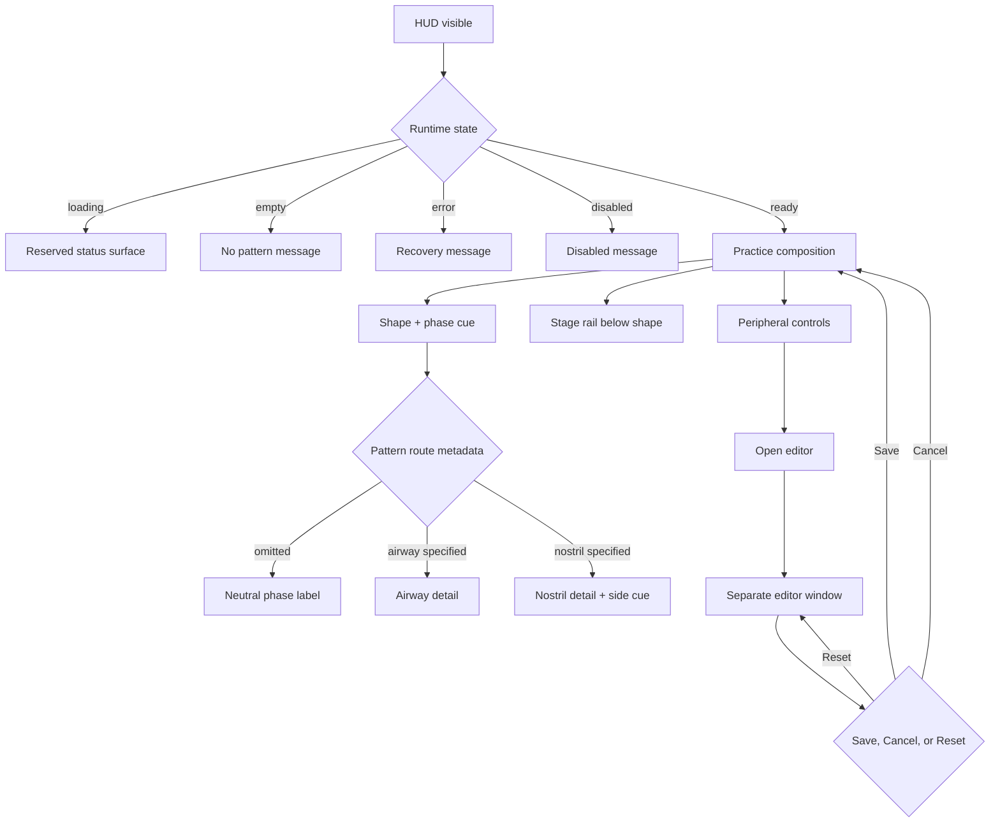

# HUD UI/UX Composition and Flow

Status: Current design source of truth for the live HUD composition. This
document complements the implementation ADRs; it does not replace the editor
or breathing-status contracts.

## Why this exists

The HUD is a small overlay, but it combines three different jobs:

1. Guide a breathing practice in real time.
2. Expose optional pattern semantics such as airway or nostril routing.
3. Provide system controls and an entry point to the separate editor.
4. Optionally reinforce phase transitions with short audio cues.

When those jobs share the same visual layer without composition rules, the
result is an intrusive UI: controls look like breathing cues, progress crosses
the shape, or ordinary phases repeat the same word twice.

The governing model is:

```text
composition = practice semantics
            x runtime state
            x HUD size
            x interaction state
            x motion preference
```

Every new element must declare which factor changes its visibility, placement,
priority, and accessible representation.

## Mental models

### 1. Practice mode: follow the breath

The user should be able to understand the current action without touching the
HUD:

1. See the breathing shape change.
2. Read the current phase when needed.
3. Read route detail only when the pattern specifies it.
4. Use the stage rail and summary to understand temporal position.

The user is not expected to operate shape, theme, or layout controls during a
breath. Those are configuration concerns.

### 2. Editor mode: configure the experience

The editor is a separate taskbar-visible window. The user edits a draft, sees
the projected preview, and chooses one explicit outcome:

```text
open -> inspect -> change draft -> preview
                         |          |
                         |          +-> Cancel: discard and close
                         +------------> Reset: replace draft, still unsaved
                         +------------> Save: validate, persist, apply
```

The editor owns configuration. The live HUD owns practice. Neither surface
should quietly become the other.

### 3. System chrome: recover and control

The toolbar, tray, pin behavior, and window lifecycle are system chrome. They
must remain visually peripheral and must not resemble phase, route, or progress
cues.

Audio is a fourth, parallel practice channel. It follows the engine's phase
transition event and never owns timing. See [Audio Cues Design](AUDIO_CUES_DESIGN.md).

## Surface ownership and hierarchy

| Surface | Primary question | Placement | Visibility rule |
| --- | --- | --- | --- |
| Breathing shape | What should I follow? | Center of breathing field | Always in ready practice |
| Phase cue | What do I do now? | Inside the breathing field | One visible phase label |
| Route detail | Through where? | Beneath phase cue | Only when airway or nostril adds detail |
| Stage rail | Where am I in the cycle? | Below the shape | Reserved band above lower controls |
| Pattern metadata | What is selected? | Peripheral lower edge | Quiet, non-interactive context |
| Utility toolbar | How do I control the HUD? | Top-right chrome region | Hover/focus, pinned, or explicit mode |
| Sequence controls | What session is running? | Lower control band | Visible only when relevant to the session |
| Sound toggle | Is audio reinforcement enabled? | Utility toolbar or tray | Explicit user choice; never required for practice |
| Editor | How do I configure it? | Separate window | Opened by Edit, tray, or shortcut |

The table is the target composition contract. The implementation is not
assumed conformant merely because a rule is written here; unresolved gaps are
listed below and must be closed through design review and visual verification.

### Non-negotiable hierarchy rules

- The breathing field must remain visually dominant.
- The live HUD must never show shape-navigation buttons beside the shape.
- Generic breathing uses vertical directional arrows only.
- Horizontal arrows are reserved for explicit nostril-side airflow.
- A plain phase is one visible label: `HOLD`, not `HOLD` plus `Hold`.
- Route detail is additive: `Inhale through left nostril` or `Exhale through mouth`.
- Stage progress must not cross the breathing shape.
- Controls must be distinguishable as controls through grouping, focus, and
  hit targets; icons alone must not carry their accessible meaning.
- Loading, empty, error, disabled, and ready states keep the same footprint.

## Runtime flow map



## Pattern semantics matrix

| Pattern data | Visible phase | Secondary detail | Arrow policy | Nostrils |
| --- | --- | --- | --- | --- |
| No airway, no nostril | `INHALE` | Hidden as redundant | Vertical only | Hidden |
| `airway: nose` | `INHALE` | `Inhale through nose` | Vertical only | Hidden |
| `airway: mouth` | `EXHALE` | `Exhale through mouth` | Vertical only | Hidden |
| `nostril: left/right` | Phase label | Active nostril instruction | Active-side horizontal cue | Visible |
| `nostril: both` | Phase label | Both-side state | Two subtle horizontal cues | Visible |
| `hold` or `pause` | `HOLD` / `PAUSE` | No duplicate phase text | No animated directional cue | Only if the pattern declares it |

Airway is optional creator-authored metadata. Omission preserves user choice.
Nostril routing is inherently nasal and should not add redundant “through
nose” copy.

Open design decision: if a creator-authored airway must remain known during a
hold or pause, add a persistent pattern/route badge in the metadata band. Do
not force that information into the phase label.

## State and composition matrix

The full Cartesian product is not a practical test plan. Use pairwise coverage
plus the explicit collision cases below.

### Runtime states

| State | Shape | Phase cue | Stage rail | Controls | Recovery expectation |
| --- | --- | --- | --- | --- | --- |
| Loading | Reserved or quiet | Loading message | Same footprint, subdued | Available but secondary | Transitions to ready or error |
| Empty | Quiet/absent | No-pattern message | Same footprint | Pattern/editor recovery available | User can choose a pattern |
| Error | Last safe visual or quiet | User-facing error | Same footprint, subdued | Recovery remains usable | Retry or choose another pattern |
| Disabled | Dimmed | Disabled reason | Same footprint, subdued | Unsupported actions disabled | Explain how to re-enable |
| Ready | Animated | One phase label | Active segmented rail | Peripheral | Normal practice |

### Shell states

| Shell state | Required composition check |
| --- | --- |
| Idle | Practice remains legible; chrome is quiet or hidden |
| Hover/focus | Toolbar appears without covering shape, cue, or stage rail |
| Pinned | Click-through and visual dimming do not remove recovery paths |
| Auto-faded | Decorative layers dim together; status remains understandable |
| Reduced motion | No progress-driven arrow fade; phase semantics remain clear |

### Size fixtures

| HUD size | Required review |
| --- | --- |
| 240px | Stage rail, summary, and lower controls do not collide |
| 300px | Baseline layout; no duplicate or overlapping cue text |
| 600px | Shape, progress band, toolbar, and metadata preserve hierarchy |

### Representative review set

At minimum, review these combinations visually:

1. 240px + generic inhale/exhale + idle and hover.
2. 300px + box hold/pause + advanced toolbar visible.
3. 600px + 4-7-8 exhale + stage band visible.
4. 300px + alternate nostril left/right/both.
5. 300px + creator-authored nose and mouth phases.
6. Each runtime state at 300px.
7. Pinned + reduced motion + keyboard focus attempt.
8. HUD hidden in tray + editor open + save/cancel return flow.

## Current coverage and known gaps

### Covered by current contracts/tests

- Editor Save, Cancel, Reset, preview states, focus behavior, and normalized draft persistence.
- Explicit breathing runtime states and transition-only announcements.
- Cached stage segments and bounded visual rail updates.
- Optional airway and nostril semantics in the shared progress snapshot.
- Generic vertical arrows and nostril-side arrow geometry.
- Tray-owned HUD lifecycle and separate editor window boundary.

### Still requiring design or visual QA

Priority P0:

- Render the representative review set in Electron and record collision results.
- Confirm the advanced toolbar never becomes the dominant visual element.
- Decide whether airway metadata persists visibly through hold/pause.
- Validate pinned click-through, focus, and keyboard recovery together.

Priority P1:

- Consolidate the canonical and legacy breathing-pattern registries.
- Add visual fixtures for auto-fade, reduced motion, and all HUD sizes.
- Define sequence-control visibility across off, active, complete, and unavailable.
- Define editor behavior when opened while the HUD is hidden or already open.

Priority P2:

- Tune copy, contrast, and metadata density after real-size visual review.
- Replace historical layout proposals with links to this composition source.

## Design review acceptance criteria

A composition change is not complete until reviewers can answer “yes” to all of
the following:

- Can a first-time user identify the current breathing action in under one
  glance?
- Can they distinguish practice guidance from controls and metadata?
- Does any new element remain in its assigned zone across 240/300/600px?
- Does the element have a defined loading, empty, error, ready, and disabled
  behavior where applicable?
- Does reduced motion preserve meaning without decorative animation?
- Does keyboard focus reveal the same hierarchy as pointer hover?
- Does the editor remain a configuration surface rather than a second live
  breathing engine?
- Is the accessible text shorter or more informative than the visible text,
  never a duplicate announcement loop?

## Related sources

- [Minimal Editor Design](MINIMAL_EDITOR_DESIGN.md)
- [Minimal Editor Component Contracts](MINIMAL_EDITOR_COMPONENT_CONTRACTS.md)
- [Minimal Editor Runtime ADR](MINIMAL_EDITOR_IMPLEMENTATION_ADR.md)
- [Nostril Breathing UI ADR](NOSTRIL_BREATHING_UI_ADR.md)
- [Controls Reference](../CONTROLS.md)
