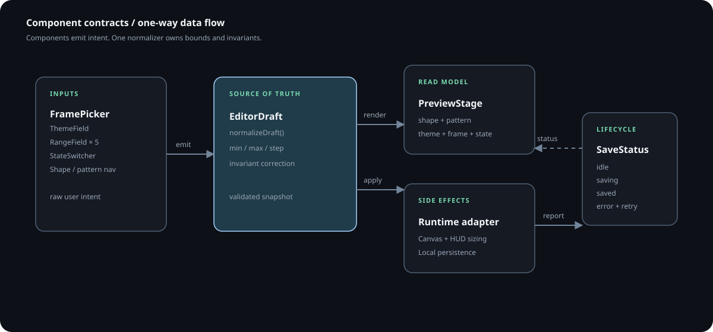
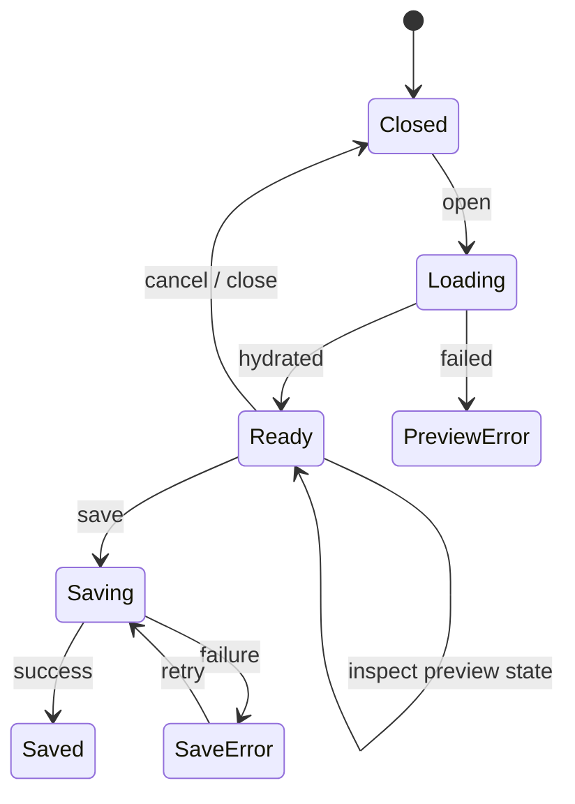

# Minimal System Editor — Component Contracts

This is the implementation handoff for the design in
[MINIMAL_EDITOR_DESIGN.md](MINIMAL_EDITOR_DESIGN.md). It assumes the current
Electron + TypeScript + DOM renderer and existing `TileControlSystem` state.

## Implemented runtime boundary

The concrete implementation is the DOM controller
`src/renderer/ui/system-editor.ts`, loaded when the editor window opens the
renderer with `?view=editor`. The controller owns draft, preview-state, focus,
and save-state transitions. It uses the shared `EditorDraft` normalizer and
never starts `EnhancedBreathingEngine`.

Electron ownership is deliberately separate:

```text
Edit button / Ctrl+Alt+E / tray
              -> main.openEditor()
              -> editor BrowserWindow (?view=editor)
              -> SystemEditor
              -> preload editor:save-draft
              -> main validates draft
              -> HUD receives hud:editor-draft-applied
```

The API-shaped interfaces below remain the conceptual component contract; the
current renderer uses DOM elements and event listeners instead of React props.

## 1. Data contracts

```ts
type EditorFrame = 'glass' | 'outline' | 'soft' | 'quiet';
type PreviewState = 'loading' | 'empty' | 'error' | 'success' | 'disabled';
type SaveState = 'idle' | 'saving' | 'saved' | 'error';

interface EditorDraft {
  readonly shapeId: string;
  readonly patternId: string;
  readonly themeId: string;
  readonly frame: EditorFrame;
  readonly intensity: number;       // 0.1..1.0, step 0.1
  readonly baseSize: number;        // 0.2..1.2, step 0.05
  readonly inhaleMax: number;       // 0.6..1.8, step 0.05
  readonly exhaleMin: number;       // 0.1..0.8, capped at baseSize
  readonly hudSize: number;         // 240..600, step 40
  readonly shapePosition: Readonly<{ x: number; y: number }>; // -80..80
}

interface EditorState {
  draft: EditorDraft;
  initialDraft: EditorDraft;
  previewState: PreviewState;
  saveState: SaveState;
  errorMessage?: string;
}
```

### Invariants

- `inhaleMax >= baseSize`.
- `exhaleMin <= baseSize`.
- Numeric values are finite and clamped before rendering or persistence.
- IDs must resolve against the existing shapes, patterns, and themes catalogs.
- `initialDraft` is immutable for the lifetime of an editor session.

## 2. Component tree

```text
SystemEditor
├─ EditorTopBar
│  ├─ ProductContext
│  ├─ SaveStatus
│  └─ CloseButton
├─ EditorShell
│  ├─ EditorSectionNav
│  ├─ PreviewCard
│  │  ├─ PreviewStage
│  │  ├─ PreviewMeta
│  │  └─ PreviewStateSwitcher
│  └─ SettingsCard
│     ├─ FramePicker
│     ├─ ThemeField
│     ├─ RangeField (intensity)
│     ├─ RangeField (base size)
│     ├─ RangeField (inhale max)
│     ├─ RangeField (exhale min)
│     └─ RangeField (HUD size)
└─ EditorFooter
   ├─ ResetButton
   ├─ CancelButton
   └─ SaveButton
```

Associated visual: [contract map](diagrams/minimal-editor-contract-map.svg).
It makes the ownership boundary explicit: components emit intent, the draft is
normalized once, and runtime/persistence are side effects.



## 2.1 Ownership at a glance

```text
controls -> normalized EditorDraft -> +--> PreviewStage
                                     +--> runtime adapter
                                     +--> persistence adapter

PreviewState -------------------------> PreviewStage only
SaveState ----------------------------> SaveStatus only
initialDraft + Cancel ----------------> restore + close
defaults + Reset ---------------------> confirm + replace draft
```

The [visual index](diagrams/README.md) groups the static SVGs with their
editable Mermaid sources.

## 3. Component APIs

### `SystemEditor`

Owns editor lifecycle, draft snapshot, focus return, and top-level state.

```ts
interface SystemEditorProps {
  initialDraft: EditorDraft;
  onChange: (draft: EditorDraft) => void;
  onSave: (draft: EditorDraft) => Promise<void>;
  onCancel: () => void;
  onReset: () => void;
}

interface SystemEditorRef {
  open(): void;
  close(): void;
  setSaveState(state: SaveState, message?: string): void;
  setPreviewState(state: PreviewState): void;
}
```

The current DOM controller exposes the same lifecycle through `initialize`,
`open`, and `close`, while save and preview-state actions are bound to the
existing editor shell controls.

DOM requirements: `role="dialog"`, `aria-modal="true"`, labelled heading,
inert background, focus return, Escape close, and no focusable descendants while
closed.

### `PreviewStage`

Renders the current draft in a fixed-size stage. It must not own persistence.

```ts
interface PreviewStageProps {
  shape: BreathingShape;
  pattern: BreathingPattern;
  theme: ThemeConfig;
  frame: EditorFrame;
  state: PreviewState;
  intensity: number;
  position: { x: number; y: number };
}
```

The preview must reserve space for state messaging. State treatment is additive
(`data-state`) so the stage dimensions never change.

### `FramePicker`

Four options, one selection, no freeform value.

```ts
interface FramePickerProps {
  value: EditorFrame;
  options: readonly EditorFrame[];
  disabled?: boolean;
  onChange: (value: EditorFrame) => void;
}
```

Use a fieldset/legend when rendered as native controls. If custom buttons are
used, implement roving tab or one-tab-per-option consistently; do not mix both.

### `RangeField`

Reusable label/value/range pattern for every numeric setting.

```ts
interface RangeFieldProps {
  id: string;
  label: string;
  value: number;
  min: number;
  max: number;
  step: number;
  format: (value: number) => string;
  helpText?: string;
  disabled?: boolean;
  onChange: (value: number) => void;
}
```

The value readout is not the accessible label by itself. The input must expose
the label and range bounds; the formatted value is supplementary.

### `PreviewStateSwitcher`

Developer/designer-facing state control that is still understandable to users.

```ts
interface PreviewStateSwitcherProps {
  value: PreviewState;
  disabled?: boolean;
  onChange: (value: PreviewState) => void;
}
```

Required options are exactly Loading, Empty, Error, Ready, Disabled. The
switcher changes only preview state, never the saved draft.

### `SaveStatus`

```ts
interface SaveStatusProps {
  state: SaveState;
  message: string;
}
```

Render in a reserved-width region with `role="status"` and `aria-live="polite"`.
Do not use a disappearing toast as the only save confirmation.

## 4. Events and state flow

```text
input/change
   -> RangeField / FramePicker / ThemeField
   -> normalizeDraft(nextDraft)
   -> TileControlSystem applies runtime preview
   -> SystemEditor receives new snapshot

Save
   -> SaveStatus(saving)
   -> persistence adapter
      -> success: SaveStatus(saved), initialDraft = draft
      -> failure: SaveStatus(error), preserve draft, focus Save

Cancel
   -> restore initialDraft
   -> close editor

Reset
   -> confirm
   -> apply DEFAULT_EDITOR_DRAFT
   -> keep editor open and show saved/idle distinction
```

The same lifecycle is available as a [Mermaid state machine](diagrams/minimal-editor-state-machine.mmd):



The renderer should own normalization in one helper. Components emit raw intent;
they should not duplicate min/max rules.

## 5. Defaults and adapter mapping

```ts
const DEFAULT_EDITOR_DRAFT: EditorDraft = {
  shapeId: 'circle',
  patternId: 'zen-simple',
  themeId: 'ocean',
  frame: 'glass',
  intensity: 0.7,
  baseSize: 0.6,
  inhaleMax: 1.0,
  exhaleMin: 0.4,
  hudSize: 300,
  shapePosition: { x: 0, y: 0 },
};
```

Current runtime mapping:

| Editor field | Existing runtime state | Existing action |
| --- | --- | --- |
| shapeId | `currentShapeIndex` | `updateShape` |
| patternId | `currentPatternIndex` | `updatePattern` |
| themeId | `currentThemeIndex` | `applyTheme` |
| intensity | `intensity` | `breathingEngine.updateIntensity` |
| base/inhaled/exhaled | breathing params | `updateBreathingParams` |
| hudSize | `hudSize` | existing resize path |
| shapePosition | `shapePosition` | engine position + nudge handlers |
| frame | `currentFrame` | `applyFrame` + runtime frame tokens |

## 6. Test contract

Unit tests should cover normalization boundaries, invariant correction, and
save-state transitions. DOM tests should cover:

- focus enters the dialog and returns to Edit;
- Escape closes, while Escape in a range does not mutate the draft;
- all frame and preview-state choices are keyboard operable;
- a failed save leaves values and error message intact;
- Cancel restores `initialDraft`;
- Reset requires confirmation and restores defaults;
- the disabled preview is inspectable without disabling the state switcher;
- no required control is below a 44px target on the mobile layout.

## 7. Suggested implementation slices

1. Add normalized draft + default constants and pure normalization tests.
2. Add editor shell and responsive tokens with static success state.
3. Add PreviewStage and FramePicker; verify keyboard and reduced-motion behavior.
4. Wire existing shape/theme/pattern/runtime actions to draft changes.
5. Add persistence, SaveStatus, Cancel snapshot, and Reset confirmation.
6. Add all state previews and mobile visual QA at 320px, 390px, 768px, and desktop.
