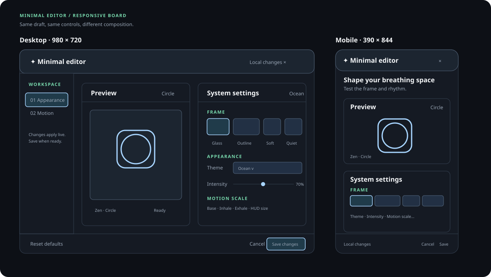
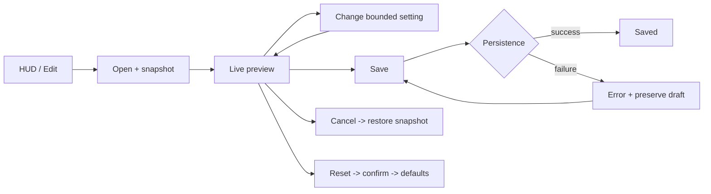
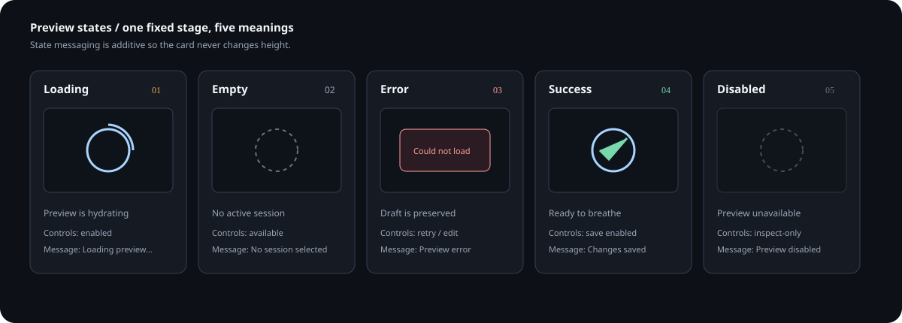

# Minimal System Editor — Product & UX Design

Status: implemented MVP integration; visual QA and future persistence hardening remain follow-ups.

Visual index: [all editor diagrams and SVGs](diagrams/README.md).

## 1. Product intent

The editor is a small, reversible playground for the Breathing HUD. It helps a
user answer one question quickly: “Does this HUD feel right on my desktop?”

It is an editor for the system presentation, not a content-authoring tool. The
user can preview a shape, breathing rhythm, theme, scale, and frame treatment,
then save the working configuration to the existing local configuration path.

### Runtime integration

The editor is a separate, taskbar-visible Electron `BrowserWindow`. The HUD
remains the small transparent runtime overlay. The Edit button, `Ctrl+Alt+E`,
and the system tray's **Open minimal editor** action all use the same
main-process open command. The editor loads the same renderer HTML in
`?view=editor` mode; that mode never starts the live breathing engine.

The preview is deterministic. It consumes a normalized `EditorDraft` and a
sample phase rather than starting a second timing loop. Saving sends the draft
through the typed preload bridge, applies it to the live HUD, and preserves the
existing local-storage persistence path.

### Design principles

- Preview first: every control has an immediate, visible consequence.
- Design-system first: values come from named tokens and bounded presets.
- Reversible by default: Cancel preserves the saved configuration; Reset is explicit.
- Calm by construction: low density, predictable controls, no decorative motion.
- State-complete: loading, empty, error, success, and disabled are inspectable.
- Keyboard-safe: focus is contained, Escape closes, sliders expose values.
- No layout shift: reserve space for status, validation, and preview messaging.

## 2. Users and use cases

| User | Job to be done | Success signal |
| --- | --- | --- |
| New user | Find a comfortable visual treatment without reading docs | Saves a preset in under 2 minutes |
| Daily user | Tune intensity and HUD size for a different screen | Changes are obvious and reversible |
| Accessibility-conscious user | Check reduced-motion and disabled/error states | Can inspect states without starting a session |
| Developer/designer | Compare frame variants against real HUD values | Preview and source values stay synchronized |

### Core use cases

1. Open Edit from the HUD, see the current saved configuration, and close without changes.
2. Choose a frame variant, switch theme, adjust intensity, and see the preview update inline.
3. Change the shape or pattern using existing bounded navigation.
4. Move the shape with drag or keyboard nudges; see the position readout.
5. Save a valid draft and receive a stable success confirmation.
6. Reset to defaults after a deliberate confirmation step.
7. Switch the preview to loading, empty, error, success, or disabled to evaluate states.

## 3. MVP boundary

### In scope

- One editor surface entered from the existing Edit control.
- Live preview of current shape, pattern, theme, intensity, and position.
- Four named frame presets: Glass, Outline, Soft, Quiet.
- Theme select using the existing visual theme catalog.
- Bounded controls for intensity, base size, inhale maximum, exhale minimum, and HUD size.
- Save, Cancel, Reset defaults.
- State switcher for the five required preview states.
- Desktop two-column layout and mobile single-column layout.
- Focus management, keyboard navigation, visible labels, live status messaging.

### Not in MVP

- Arbitrary CSS editing or custom frame construction.
- Multi-page navigation, template sharing, cloud sync, or version history.
- Timeline/sequence authoring.
- Freeform placement of every HUD control.
- New persistence or backend APIs.
- A second renderer. The preview should consume the same normalized draft values
  as the existing Canvas renderer.

## 4. View inventory

### V0 — HUD / entry point

The existing HUD remains the lightweight runtime surface. Edit opens the
separate editor window; it does not become a new breathing mode. The current
mode (Zen, Basic, Advanced) is preserved when the editor opens.

### V1 — Editor / desktop

- Top bar: product context, “Minimal editor”, save status, close.
- Left rail: Appearance and Motion anchors; short help text.
- Main: Preview card beside System settings card.
- Footer: Reset defaults on the left; Cancel and Save changes on the right.

### V2 — Editor / mobile

- Top bar remains fixed and compact.
- Rail collapses into section headings or a simple stacked order.
- Preview card comes first, settings follow.
- Footer actions remain reachable without horizontal scrolling.
- Main content scrolls; the preview and controls never compete for width.

### V3 — State inspection

State inspection is embedded in the Preview card, not a separate route. A
segmented state switcher lets the user check all required states while leaving
the draft values unchanged.

## 5. Wireframes

### Desktop, 980 x 720 minimum

```text
┌──────────────────────────────────────────────────────────────────────────────┐
│  ✦  BREATHING HUD / SYSTEM     Minimal editor       Local changes       ×    │
├──────────────┬───────────────────────────────────────────────────────────────┤
│ WORKSPACE    │  Shape your breathing space                    • Live preview │
│              │  Test the frame, rhythm, and visual weight.                  │
│ 01 Appearance│                                                               │
│ 02 Motion    │  ┌─────────────────────────┐  ┌───────────────────────────┐ │
│              │  │ Preview                 │  │ System settings            │ │
│ Changes      │  │                         │  │                             │ │
│ apply live.  │  │       ┌─────────┐       │  │ FRAME                       │ │
│ Save when    │  │       │  shape  │       │  │ [Glass] [Outline] [Soft]   │ │
│ ready.       │  │       └─────────┘       │  │ [Quiet]                     │ │
│              │  │                         │  │                             │ │
│              │  │ Zen · Circle            │  │ APPEARANCE                  │ │
│              │  │ State: Ready / Empty... │  │ Theme       [Ocean       v]  │ │
│              │  └─────────────────────────┘  │ Intensity   ───●──── 70%    │ │
│              │                               │                             │ │
│              │                               │ MOTION SCALE                │ │
│              │                               │ Base / Inhale / Exhale / Size│ │
│              │                               └───────────────────────────┘ │
├──────────────┴───────────────────────────────────────────────────────────────┤
│ Reset defaults                                      Cancel      Save changes │
└──────────────────────────────────────────────────────────────────────────────┘
```

### Mobile, 390 x 844

```text
┌──────────────────────────────────────┐
│ ✦  Minimal editor          Local  ×  │
├──────────────────────────────────────┤
│ Shape your breathing space            │
│ Test the frame and rhythm.            │
│                         • Live preview│
│                                      │
│ ┌──────────────────────────────────┐ │
│ │ Preview                     Circle│ │
│ │                                  │ │
│ │             shape                │ │
│ │                                  │ │
│ │ Zen · Circle                     │ │
│ │ State [Loading][Empty][Ready]... │ │
│ └──────────────────────────────────┘ │
│                                      │
│ ┌──────────────────────────────────┐ │
│ │ System settings             Ocean │ │
│ │ FRAME                            │ │
│ │ [Glass] [Outline]                │ │
│ │ [Soft]  [Quiet]                  │ │
│ │ APPEARANCE                       │ │
│ │ Theme       [Ocean           v]  │ │
│ │ Intensity   ─────●────── 70%    │ │
│ │ MOTION SCALE                     │ │
│ │ Base size   ─────●────── 0.60   │ │
│ │ ...                              │ │
│ └──────────────────────────────────┘ │
├──────────────────────────────────────┤
│ Local changes             Cancel Save │
└──────────────────────────────────────┘
```

### Linked visual references

The [responsive layout board](diagrams/minimal-editor-layout.svg) is the visual
source for the two wireframes above. It shows the same information hierarchy
reflowing from desktop two-column to mobile stacked composition.



Source: [minimal-editor-layout.svg](diagrams/minimal-editor-layout.svg).

### ASCII anatomy

This compact view is useful in tickets, pull requests, and terminal-only review:

```text
+--------------------------------------------------------------------------+
| editor topbar: context / title / save status / close                     |
+-------------+------------------------------------------------------------+
| section nav | page heading + live preview status                         |
|             +--------------------------+---------------------------------+
| appearance  | preview                 | system settings                 |
| motion      |                          |                                 |
|             | fixed stage             | frame picker                    |
|             | state switcher          | theme select                    |
|             | shape + metadata        | range fields                    |
|             |                          |                                 |
+-------------+--------------------------+---------------------------------+
| footer: reset defaults                              cancel | save        |
+--------------------------------------------------------------------------+
```

### User flow diagram



Full editable source: [minimal-editor-flow.mmd](diagrams/minimal-editor-flow.mmd).
The flow is intentionally one-way: controls emit intent, normalization updates
the draft, and the preview reads that draft.

## 6. State model

| State | Preview treatment | Editor behavior | Required message |
| --- | --- | --- | --- |
| Loading | Shape remains in place; subtle non-essential indicator | Controls remain enabled; Save is disabled only while persistence is pending | “Loading preview…” |
| Empty | Dimmed stage with no active session | Settings remain available | “No session selected” |
| Error | Stable error panel over preview; do not collapse card | Preserve draft; offer retry or continue editing | “Preview could not be loaded” |
| Success | Normal live preview and green status | Save enabled when draft is valid | “Ready to breathe” / “Changes saved” |
| Disabled | Dimmed preview and controls with clear disabled affordance | State is inspect-only; state switcher remains available | “Preview is disabled” |

See the [state board](diagrams/minimal-editor-states.svg) for a visual comparison
of message, affordance, and control policy across all five states.



Source: [minimal-editor-states.svg](diagrams/minimal-editor-states.svg).

The state transitions are documented as an editable
[state machine diagram](diagrams/minimal-editor-state-machine.mmd).

### Persistence state

The save status area is reserved at all times to avoid layout shift:

`idle → saving → saved` or `idle → saving → error`.

The error state must keep the draft in memory and expose a retryable Save action.
Reset is separate from persistence state and requires confirmation because it
clears the current local draft.

## 7. Token direction

Use semantic tokens rather than one-off values. Existing theme variables remain
the source of truth for the preview accent colors.

```text
color.surface.canvas       editor background
color.surface.panel        card background
color.surface.raised       selected / hover background
color.content.primary     titles and values
color.content.secondary   descriptions and field labels
color.content.muted       metadata and helper text
color.action.focus        keyboard focus ring
color.status.success      saved / ready
color.status.danger       error
border.subtle             card and divider lines
radius.control            8px
radius.card               14px
space.1..6                4 / 8 / 12 / 16 / 24 / 32px
target.minimum            44px for touch controls
```

Frame presets are semantic contracts, not CSS names exposed to users:

| ID | Intent | Runtime treatment |
| --- | --- | --- |
| `glass` | Default, contextual | translucent fill, blur, restrained glow |
| `outline` | High clarity | transparent fill, stronger border |
| `soft` | Gentle / approachable | rounded fill, low contrast shadow |
| `quiet` | Least distracting | low-contrast border, reduced ornament |

## 8. Accessibility and responsive rules

- Use `main`, `header`, `aside`, `section`, and `footer` landmarks.
- Label the editor window with `aria-labelledby`; when layered over the HUD,
  mark the background inert.
- Move focus to the editor heading on open. Closing the separate window returns
  OS focus to the previous surface; the embedded browser fallback returns focus
  to the invoking element.
- Keep a visible `:focus-visible` ring with at least 3:1 contrast against the
  adjacent surface.
- Every range has a visible label, min/max/step, and adjacent value readout.
- Radio-like frame and state choices expose `role="radio"` and
  `aria-checked`; keyboard activation works with Enter and Space.
- Do not rely on color alone for error, success, selected, or disabled states.
- Respect `prefers-reduced-motion`; the preview remains understandable when all
  animation is removed.
- At widths below 760px, stack Preview before System settings and keep the
  bottom actions visible after content, without horizontal scroll.

## 9. MVP acceptance criteria

- A user can open and close the editor without losing the current HUD mode.
- A user can open the editor from Edit, `Ctrl+Alt+E`, or the system tray.
- The editor window is taskbar-visible and does not resize or replace the HUD.
- Every frame choice is visibly distinct in the preview and is keyboard reachable.
- Adjusting a bounded control updates its value readout without layout shift.
- Shape, pattern, theme, and position values shown in the editor match runtime state.
- Loading, empty, error, success, and disabled states can each be previewed.
- Invalid or failed saves preserve the draft and expose a retry path.
- Reset is deliberate, restores documented defaults, and communicates completion.
- The mobile layout is usable at 320px wide with 44px minimum interactive targets.
- Existing HUD navigation and keyboard shortcuts continue to work after close.

## 10. Resolved implementation decisions

1. Save keeps the editor open and shows a saved status so the user can continue
   exploring.
2. Frame style affects both the editor preview and runtime HUD through one
   normalized `frame` value.
3. Draft changes are preview-only until Save; Cancel restores the opening
   snapshot.
